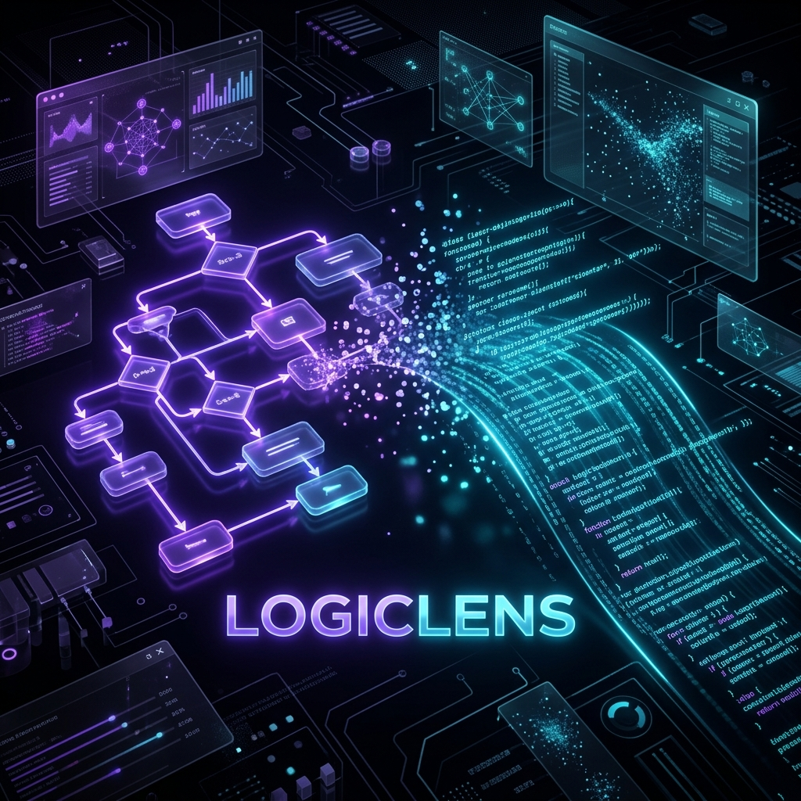

<div align="center">
  

  <h1>LogicLens — Sketch to App, Instantly</h1>
  <p>An AI-powered visual development environment that instantly converts your rough whiteboard sketches and architectural diagrams into functional, production-ready React applications.</p>

  <p>
    ▶️ <a href="https://youtu.be/AGeLCxv_Vjs"><strong>Watch Demo Video</strong></a> · 
    🌐 <a href="https://logic-lens-mauve.vercel.app/"><strong>View Live Project</strong></a>
  </p>

  <p>
    
    
    
    
    
  </p>
</div>

---

## 🚀 Demo & Live Deployment

- ▶️ **Demo Video:** [https://youtu.be/AGeLCxv_Vjs](https://youtu.be/AGeLCxv_Vjs)
- 🌐 **Live Application:** [https://logic-lens-mauve.vercel.app/](https://logic-lens-mauve.vercel.app/)

*(Note: If testing locally, please ensure you supply your own Gemini API keys in `.env.local`)*

---

## 💡 What LogicLens Does

**LogicLens bridge the gap between ideation and implementation.** 

Traditional software development requires translating visual intent (whiteboards, wireframes, flowcharts) into code manually. LogicLens automates this by providing an integrated whiteboard where you can draw your UI wireframes or logic flowcharts. With a single click, it uses an advanced multi-modal AI pipeline to "see" your intent, understand the logical structure, and instantly synthesize a fully functional, multi-file React application. 

### Key Features
- **Integrated Excalidraw Canvas:** Draw wireframes, logic flows, and UI layouts natively in the browser.
- **Real-Time Code Streaming:** Watch your application code write itself line-by-line via SSE (Server-Sent Events).
- **Live Interactive Sandbox:** The generated code is instantly mounted in a live, in-browser Sandpack (CodeSandbox) environment where you can interact with your new app.
- **Surgical Refinement Chat:** Not quite right? Open the AI Refinement Chat and give natural language feedback (e.g., *"make it dark themed"* or *"add a sort button"*). The AI surgically patches the specific files in milliseconds.
- **Export to ZIP:** Download your generated project with one click, ready to run locally.

---

## 🧠 How We Used the Gemini API

LogicLens leverages the multimodal capabilities of **Google Gemini** through a sophisticated, multi-phase Edge pipeline to guarantee structural integrity and visual accuracy.

### Phase 1: Semantic Parsing (`gemini-2.5-flash`)
When you hit "Generate", the canvas snapshot is sent to Gemini Flash. Instead of asking for code immediately, we ask Flash to act as a **Systems Architect**. It analyzes the raw image and extracts a structured JSON `LogicGraph`. This graph defines the component hierarchy, state requirements, data flow, and styling intentions extracted from the drawing. We enforce a strict Zod schema on this response.

### Phase 2: Code Synthesis (`gemini-2.5-pro`)
The extracted `LogicGraph` JSON *and* the original sketch image are then passed to Gemini Pro. Gemini Pro acts as the **Senior Frontend Engineer**. By feeding it both the semantic intent (JSON) and the spatial layout (Image), Gemini Pro synthesizes highly accurate, production-ready React code. The response is streamed back to the client via Edge Functions (Server-Sent Events) to provide instant feedback.

### Phase 3: Surgical Refinement (`gemini-2.5-pro`)
When a user requests a change via the chat, we don't regenerate the whole app. We send the current state of the code, the user's prompt, and the original context to Gemini Pro, instructing it to act as a **Code Reviewer**. It streams back targeted `[NEW]`, `[MODIFY]`, and `[DELETE]` file patches, drastically reducing latency and token usage.

### Resilience: Dual-Key Failover
To handle rate limits and 429 Resource Exhausted errors seamlessly during hackathon testing, we implemented a custom dual-key proxy wrapper. If `GEMINI_API_KEY_1` hits a quota error mid-stream, the system transparently intercepts the error, switches the streaming context to `GEMINI_API_KEY_2`, and resumes generation without the user ever noticing.

---

## 🛠️ Tech Stack

- **Framework:** [Next.js 15](https://nextjs.org/) (App Router, Edge Functions)
- **Language:** [TypeScript](https://www.typescriptlang.org/)
- **Styling & UI:** [Tailwind CSS v4](https://tailwindcss.com/), [Framer Motion](https://www.framer.com/motion/)
- **AI Models:** [Google Gemini 2.5 Flash & 2.5 Pro](https://ai.google.dev/)
- **Canvas Engine:** [Excalidraw](https://excalidraw.com/)
- **Live Preview:** [Sandpack (CodeSandbox)](https://sandpack.codesandbox.io/)
- **State Management:** [Zustand](https://github.com/pmndrs/zustand)
- **Validation:** [Zod](https://zod.dev/)
- **File Export:** [JSZip](https://stuk.github.io/jszip/)

---

## ⚙️ How to Install and Run Locally

### 1. Prerequisites
- Node.js (v18 or higher)
- At least one [Google Gemini API Key](https://aistudio.google.com/app/apikey) (Free tier works perfectly).

### 2. Clone and Install
Clone the repository and install the dependencies:
```bash
git clone https://github.com/hmcommits/LogicLens.git
cd LogicLens
npm install
```

### 3. Configure Environment Variables
Copy the example environment file:
```bash
cp .env.example .env.local
```
Open `.env.local` and add your Gemini API keys:
```env
GEMINI_API_KEY_1=your_first_key_here
GEMINI_API_KEY_2=your_second_key_here
```
*(If you only have one key, simply paste it into both variables).*

### 4. Run the Development Server
```bash
npm run dev
```
Open [http://localhost:3000](http://localhost:3000) in your browser.

---

## 🎨 User Workflow

1. **Draw:** Navigate to the Canvas and sketch a UI layout or flowchart.
2. **Generate:** Click the big blue button. LogicLens will parse the image and stream the code.
3. **Interact:** Play with your fully functional web app in the live Sandpack preview window.
4. **Refine:** Open the Refinement Chat at the bottom and ask the AI to change colors, add logic, or swap components.
5. **Export:** Click the "Export" button in the top bar to download your generated React app as a `.zip` file.

---

<div align="center">
  <i>Built for the Gemini AI Hackathon</i>
</div>
